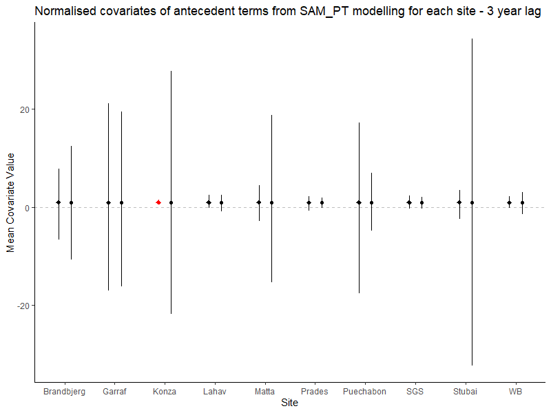
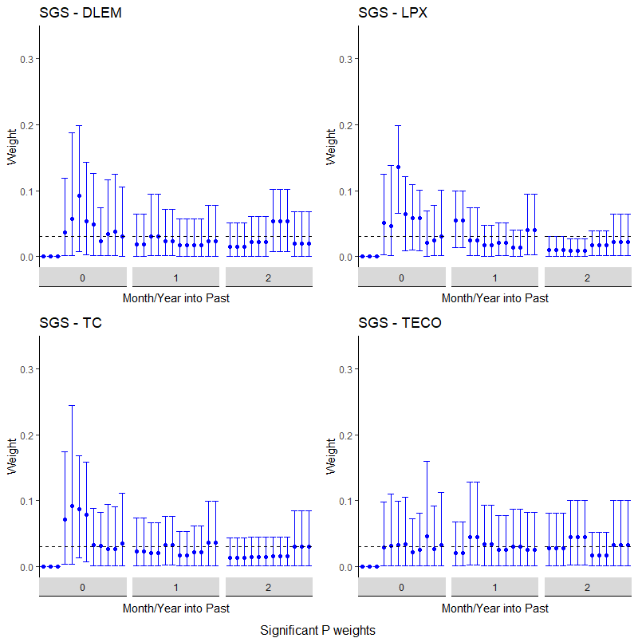

```{r setup, include=FALSE}
knitr::opts_chunk$set(echo = TRUE)
```

## ISSUE - 27/05/2020

Some of the sites had missing ANPP data in the middle of their datasets. The original method of removing these just, well, removed them and the corresponding years. This meant that the data series was no longer consecutive and may have affected the site results. The sites affected are:

* Lahav
* Matta
* Prades
* SGS

e.g. At Lahav, the year 2005 was removed and so 2004 and 2006 became consecutive in the data series. 

A new method of removing years missing ANPP data only removes them from the beginning and end of the data series (because ideally we don't want missing ANPP). It leaves in any missing data in the middle of a time series (note all sites only had 1 year of missing data at most) as SAM can deal with this by inferring a value for the missing year (this does increase the importance of a decent prior). 
All old outputs for these 4 sites have been archived and new model runs are being conducted.

This workbook has since been updated with the new model work and should now be correct.


## SAM ANPP Model Analysis

This is a R Markdown file to collect my curated thoughts and outputs resulting from this project. I am attempting to explore the ability of various terrestial biosphere models (TBMs) to predict ecosystem productivity and the role that antecedent conditions of climatic drivers play in productivity responses.

More incoherent ramblings are saved in a LaTeX document on Overleaf - this file is a summary of my progress.

### P-ANPP SAM Modelling of Sites

The first step was to model the 10 sites from Paschalis et al (2020) using the SAM approach with precipitation (P) as the only driver. The key result from this is that only one sites indicate a significant response of ANPP to antecedent P, as per the below figure


This is Konza 


I have run the SAM script for 1, 2, 4 and 5 year lags as well. An interesting result is that antecedent rainfall at Lahav is NOT SIGNIFICANT at these lag lengths - this to me implies an issue. If a 3 year lag is significant, the method should result in a 5 year lag ALSO being significant - if years 4 and 5 have no impact then their weights should just be small relative to the significant years.

| | |
|:-:|:-:|
|1 Year|2 Year|
|||
|4 Year|5 Year|
|||


I have added temperature to the model - it is in exactly the same form as the antecedent precipitation. This is currently using mean monthly temperature which I believe will "smooth" the input too much and make it difficult to distinguish any dependence. 

In the below plots, diamonds (on the left) are the P covariate and circles (on the right) are the T covariate. Red indicates that they are significantly different from 0. The covariates have been normalised by dividing by the mean but the extensive CIs at individual sites mean that the error bars at some sites are still not visible. I am not happy with these plots - they could be much more readable.

| |
|:-:|
|1 Year|
||
|2 Year|
||
|3 Year|
||
|4 Year|
||
|5 Year|
||

I see the below issues:

  * Similarly to the P model, site covariates lose significance when longer lags are explored. This is not ideal behaviour in the model.
  * Sites report differing significance of the P covariate between the P and PT models. What does this mean in terms of the site's dependence on antecedent P?
  
## Model Comparison
  
The SAM method is applied to all sites using the modelled ANPP data from the 5 models. The results can then be compared to SAM outputs for the observed ANPP. This will hopefully provide insight into the following:
  
* Whether models capture any lags evident in the data
* Why models might differ in their outputs - do some models have a lag effect where others don't?


Thoughts:

* A clear result in the correlation between obtaining significant results for the covariates and the length of the data series available. 
* Models exhibit greater occurrences of antecedent dependence than the observations. 
* Martin pointed out that Prades has 13 years of data but no lagged P response. 
* Lack of temperature dependence is likely due to use of mean monthly temperatures.

#### SGS

We now focus on SGS, in particular the antecedent P term, and look into the differences between the models. SGS is a grassland site with low MAT (8.5C) and low rainfall (300mm). These are both the 2nd lowest of all sites. Coefficient of variation for precipitation is high however at 0.4, the highest of all sites.

The site is likely temperature and water limited. As such, when the precipitation falls is probably quite important. 




No models show any real long-term seasonal lags with weights in years 1 and 2 being largely uniform. The lags are noticeably more heavily weighted to year 0 in DLEM, LPX and TC. However, observations of ANPP and P at SGS show no correlation. *How accurately do these models capture the behaviour at SGS?*

Martin suggested that the difference between models might be due to LAI differences.


The models however have totally different LAI profiles. Martin suggests that looking into GPP might give further insight. The below equation is ANPP but I should remember that allocation to roots is another component of total GPP:

$ANPP = GPP_{leaf} + GPP_{stem} - R_{A}$

We want to determine why each model suggests that ANPP is related to P. It might be worth checking correlation of P to modelled ANPP for these models - do we even need the lags?


## Testing sampled Konza data

I have written a script which runs SAM for every consecutive run of 10 years at Konza. Note the script takes any site, model, or sample length. I used Konza and observations as this is the longest dataset.


This is very interesting. There is a period of time 1987-2000 which exhibits significance on P while nowhere else does. I need to look at these dates and see if there is anything different compared to the years that don't produce significance.