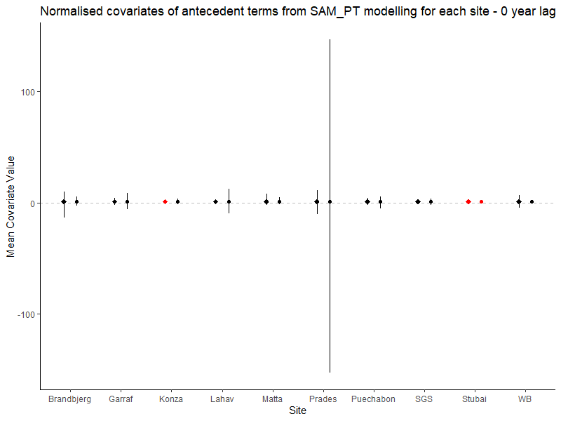
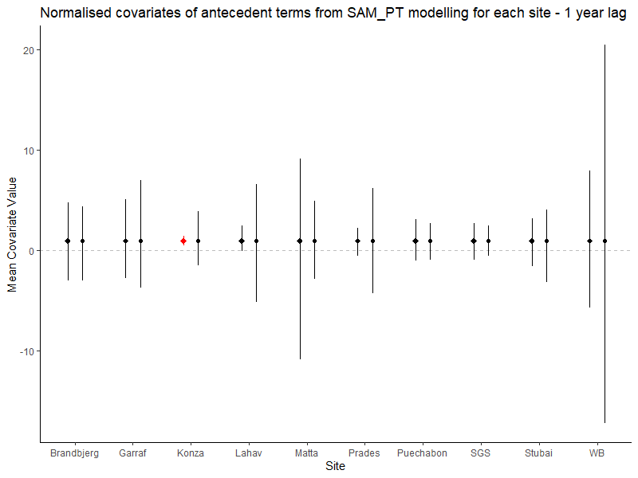
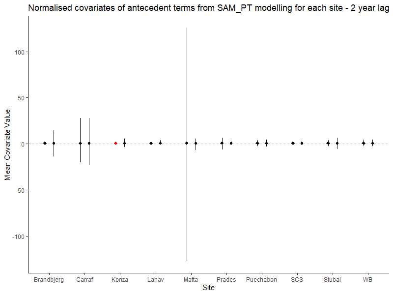

```{r setup, include=FALSE}
knitr::opts_chunk$set(echo = TRUE)
```

## SAM ANPP Model Analysis

This is a R Markdown file to collect my curated thoughts and outputs resulting from this project. I am attempting to explore the ability of various terrestial biosphere models (TBMs) to predict ecosystem productivity and the role that antecedent conditions of climatic drivers play in productivity responses.

More incoherent ramblings are saved in a LaTeX document on Overleaf - this file is a summary of my progress.

### P-ANPP SAM Modelling of Sites

The first step was to model the 10 sites from Paschalis et al (2020) using the SAM approach with precipitation (P) as the only driver. The key result from this is that only two sites indicate a significant response of ANPP to antecedent P, as per the below figure


The monthly weights for these two sites offer no immediate information about which lags are most important - although Konza has more noticeable spikes than Lahav.


I have run the SAM script for 1, 2, 4 and 5 year lags as well. An interesting result is that antecedent rainfall at Lahav is NOT SIGNIFICANT at these lag lengths - this to me implies an issue. If a 3 year lag is significant, the method should result in a 5 year lag ALSO being significant - if years 4 and 5 have no impact then their weights should just be small relative to the significant years.

| | |
|:-:|:-:|
|1 Year|2 Year|
|||
|4 Year|5 Year|
|||


I have added temperature to the model - it is in exactly the same form as the antecedent precipitation. This is currently using mean monthly temperature which I believe will "smooth" the input too much and make it difficult to distinguish any dependence. 

| | |
|:-:|:-:|
|1 Year|2 Year|
|||
|3 Year|4 Year|
|||
|5 Year||
|||